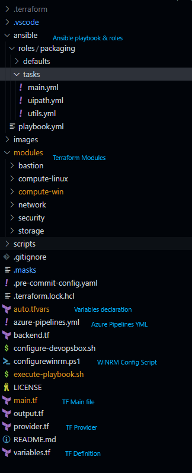

# POC using Terraform and Powershell
This folder contains the source code related to Terraform, for provision VM on Azure and Customizing it using Powershell

## Terraform Resource Provisioning
Below diagram shows the basic structure of the resources provisioned by Terraform </br>
 


## Solution Structure
Below diagram shows the basic structure of the terraform solution </br>
 
## Executing the Terraform Scripts
```
# Export the credentials to the session
export ARM_CLIENT_ID=""
export ARM_SUBSCRIPTION_ID=""
export ARM_TENANT_ID=""
export ARM_CLIENT_SECRET=""
export ARM_ACCESS_KEY=""

# Terraform Initialisation
terraform init

# Terraform Plan
terraform plan -var-file=auto.tfvars

# Terraform Apply
terraform apply -var-file=auto-tfvars
```

## Targetted apply of Modules in Terraform
We can do targetted apply of just the modules if doesnt have dependency . Here is a script for  for Storage Account
```
terraform plan -var-file=auto.tfvars -target=module.storage
terraform apply -var-file=auto.tfvars -target=module.storage
```

## Bastion host for secure access of VM
By default VM provisioned on Azure can be accessed publicaly. In secure way, it is best to access via a BastionHost which act a gateway to the VMs inside the subnet. </br>


## Ansible Control Server Setup [Ubuntu]
The machine must have python3 and pip3 installed to configure python libraries. On the windows host machines WINRM needs to be configured first inorder for ansible to communicate and work
```
sudo apt-get update
sudo apt-get install python3-dev python3-pip ansible
pip3 install setuptools-rust pywinrm
pip3 install --upgrade pip
pip3 install ansible[azure]
ansible-galaxy install azure.azure_preview_modules

# Export Credentials into session, so that Ansible can use the values
export AZURE_CLIENT_ID=""
export AZURE_SUBSCRIPTION_ID=""
export AZURE_TENANT=""
export AZURE_SECRET=""
```

## Notes
1. https://learn.microsoft.com/en-us/samples/azure-samples/ansible-playbooks/ansible-playbooks-for-azure/
2. Configure - [WINRM](https://raw.githubusercontent.com/ansible/ansible/devel/examples/scripts/ConfigureRemotingForAnsible.ps1)
## Issues on the code

1. Being on trial subscription, machines provisioned wont able to join  Azure AD. Unable to map any svc accounts and login with the account
2. Softwares need to be in place
3. Different Machine types for environments
4. Different VNET networks for different environments?
5. Since the machines are not AAD joined, not detectable on Orchestrator
